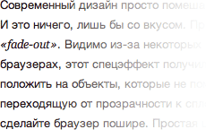
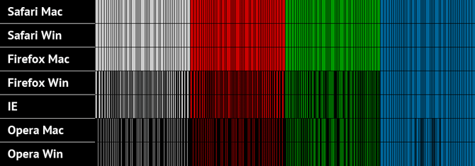

Размытие как оно есть

Современный дизайн просто помешан на спецэффектах, он, можно сказать, только ими и живёт. И это ничего, лишь бы со вкусом. Приходится иногда делать такую штуку как размытие или fade-out. Видимо из-за некоторых проблем с реализацией `text-overflow: ellipsis` в браузерах, этот спецэффект получил некоторую популярность. Суть его сводится к тому, чтобы положить на объекты, которые не помещаются в рамки родителя, некую картинку, плавно переходящую от прозрачности к сплошному цвету. Мол, не поместилось — прокрутите или сделайте браузер пошире. Простая штука, на самом деле.

И всё бы ничего, но в какой-то момент я стал замечать, что _выведенный из цвета в ноль градиент_ как-то не слишком точно ложится на _тот же самый цвет_. Покрутил-повертел: вроде не цветовые профили, да и цвета не напутал. Отложил, забылось.

И тут сегодня мне приходит письмо: мол, такие дела — как-то всё странно и плохо накладывается, вот вам тестовый пример. Спасибо, — говорю, — посмотрим. Посмотрел: и правда, какая-то чертовщина. Скажу сразу, внятного объяснения я так и не нашёл. Так вот…

## Эксперимент

Сначала рисуем в Фотошопе пять квадратов:

- Квадратная шейпа, заливка (`fill`) уведена в ноль;
- внутри эффектом наложен горизонтальный линейный градиент: от выбранного цвета к нему же;
- левая часть градиента уведена в нулевую прозрачность.

Квадратные шейпы положены рядом, под каждой из них помещён растровый квадрат со сплошной заливкой, соответствующей основному цвету градиента. Режим смешения (blending mode) каждого из слоёв выставлен в «Normal». Тем самым, мы избавляемся от любых визуальных проявлений градиента. Экспортированная в PNG-8 картинка получается такой:

Пять цветных квадратов, нарисованных в Фотошопе

Любые попытки потрогать её пипеткой, приводят ровно к пяти цветам, как и ожидалось. Дальше верстаем такие же пять квадратов размером 200 × 200 пикселов. Каждому из них присваивается класс, накладывающий градиентную картинку (полупрозрачный PNG-24, почищенный при помощи [ImageOptim](http://imageoptim.pornel.net/)) на соответствующий фоновый цвет:

    .color-000 {
        background: #000 url(000.png) no-repeat;
    }

    .color-ccc {
        background: #ccc url(ccc.png) no-repeat;
    }

    .color-c00 {
        background: #c00 url(c00.png) no-repeat;
    }

    .color-090 {
        background: #090 url(090.png) no-repeat;
    }

    .color-069 {
        background: #069 url(069.png) no-repeat;
    }

Такое наложение имитирует слои в Фотошопе. В браузерах вышла следующая картина:

Пять цветных квадратов, свёрстанных в браузере

[Свёрстанная страница](demo) выглядит так же, как экспортированная картинка. Даже если очень сильно приблизить. Но это если на первый взгляд, а если повозить по этому делу пипеткой (попробуйте сами), то получается что-то странное: цвет начинает дрожать. Например, мой любимый оттенок красного `#cc0000` прыгает красной составляющей в `#cb0000` (или 204–203, если в системе RGB). Исключение составил чёрный квадрат и, как выяснилось, другие простые цвета (`#00f`, `#ff0` и так далее) — они состоят из одного сплошного цвета.

Проблемы, как известно, передвигаются стаями. Поэтому давайте усложним задачу и протестируем это цветосмешение в разных браузерах. Сделаем скриншоты в семи браузерах, составим их вместе и удалим из картинок основной цвет каждого из квадратов, чтобы понять по какому принципу происходит смешение. Результат обескураживает:

Сравнение пяти цветных квадратов в семи разных браузерах

Смешение разнится не только в разных браузерах и разных системах, но ещё и для разных цветов. На этом этапе любые эксперименты хочется прекратить и громко спросить кого-то: «Что за дела, шеф?!» Ответа, как обычно, не следует. Поэтому попробуем предположить что-нибудь самостоятельно.

Никаких проблем с гаммой, цветовыми профилями и другими чанками в PNG быть не может — файлы почищены всеми возможными утилитами. Единственное, что приходит мне в голову — это нехватка цветов в некоторых цветовых диапазонах, которая заставляет браузеры делать смешение (dithering) пограничных цветов для имитации недостающего. Но почему в некоторых диапазонах всё проходит гладко, да и сам Фотошоп справляется на «отлично»…

Кажется у меня ещё осталась «Помощь зала». Идеи?

**UPD:** В комментариях были предложены весьма достойные версии происходящего: [первая](#comment-4742) и [вторая](#comment-4760) — обе, в общем-то, об одном и том же: сложности округления.
