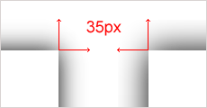

Нет, у меня всё в порядке с рассудком — я не пытаюсь сравнить тёплое с мягким. Дело в том, что буквально только что вышла вторая бета Firefox 3.1, помимо всяческих `<audio>` и `<video>`, поддерживающая набор [новых интересных CSS-свойств](http://developer.mozilla.org/en/Firefox_3.1_for_developers#Web_site_and_application_changes).

В частности, появилась поддержка свойства `box-shadow`, пока с только с вендорным префиксом `-moz-box-shadow`. Свойство — свойством, ничего серьёзного — блок просто сможет отбрасывать тень. Но если подумать, то `box-shadow` входит в группу сложных визуальных свойств вроде `border-radius`, `border-image`, `text-shadow`, реализация которых по-настоящему полезна только в том случае, когда все браузеры не только корректно поддерживают синтаксис правила, но ещё и более-менее одинаково отрисовывают все спецэффекты.

Помимо Firefox 3.1, свойство `box-shadow` уже более полутора лет поддерживает [Webkit](http://webkit.org/), а вместе с ним, с некоторых пор, и Safari 3.1, а также… уже чёрт знает сколько лет, `box-shadow`, точнее `drop-shadow`, умеет делать Photoshop.

Поскольку Photoshop является отраслевым стандартом для отрисовки макетов, то вполне логично принять его способ отбрасывания тени за эталонный. Речь о качестве этой тени сейчас не идёт. Параметры фильтра **Drop Shadow** максимально приближены к значениям свойства `box-shadow` в дальнейших примерах:

- Color: #000
- Opacity: 100%
- Distance: 0
- Spread: 0
- Size: 100px

Photoshop, drop shadow

**Photoshop, drop shadow** — таким образом, размер видимой тени в данном случае составил 94 из заданных 100 пикселов — таковы особенности создания тени этим редактором.

Следующим продемонстрирует нам способность отбрасывать тень браузер, больше известный как «убийца IE», — Firefox. И вот что ему для этого нужно: `-moz-box-shadow: 0 0 100px #000`

Синтаксис сокращённого правила в нашем примере таков:

- Горизонтальное смещение
- Вертикальное смещение
- Величина размытия (spread)
- Цвет тени (color)

Подробное описание свойства `box-shadow` доступно в [черновиках W3C](http://www.w3.org/TR/CSS3-background/#the-box-shadow).

Firefox, box-shadow

В скобках указаны примерные аналоги настроек фильтра Drop Shadow в Photoshop, за исключением смещения — оно работает иначе и получается из сочетания значений angle и distance.

**Firefox, box-shadow** — размер тени в данном случае составил ровно 100 пикселов (ну, как сказали — так и сделал) и по структуре своей выглядит несколько грубее, чем в предыдущем примере. Однако стоит отметить довольно близкое сходство с нашим эталоном.

Завершает показательные выступления браузер Safari, в котором свойство `box-shadow` хоть и появилось впервые на рынке, но до сих пор прячется за префиксом: `-webkit-box-shadow:0 0 100px #000`

Safari, box-shadow

**Safari, box-shadow** — и мы видим нечто необычное. Несмотря на указанную величину размытия в 100 пикселов, размеры видимой тени составили всего 35 пикселов.

До выхода версии Firefox, поддерживающей это свойство, и до попыток сравнивать способ отбрасывания тени с эталонным, такое поведение казалось вполне нормальным — ну мало ли какой там механизм размытия, мало ли от какой точки ведётся отсчёт. Теперь же возникает очевидная сложность — для использования данного свойства нужно быть уверенным если уж и не в идентичности способов отображения тени в основных браузерах, то хотя бы в примерной схожести.

Выхода из этой ситуации может быть два:

- Подробное описание в спецификации CSS3 способа формирования тени, не допускающее сколь-нибудь серьёзных различий в браузерах, которые заявили о полной поддержке спецификаци.
- При отсутствии в спецификации подробных инструкций по формированию тени, производители браузеров могут просто договориться о каком-то компромиссе.

И пока в черновиках спецификации указано the exact algorithm is not specified, нам остаётся придумывать способы скомпенсировать разницу в реализациях этого непростого свойства — благо у нас пока есть вендорные префиксы.

К примеру, данный код выводит приблизительно одинаковые тени, как в Firefox 3.1, так и в Safari 3.1:

    -moz-box-shadow: 0 0 34px #000;

Safari vs. Firefox, box-shadow

Достигнуто это было методом _научной подгонки_ — как размера тени, так и диапазона от начального до конечного цветов градиента. Методика не то чтобы очень удобная, но при желании _сделать красиво_ для современных браузеров можно и повозиться.

К слову сказать, Safari, при увеличении размеров тени до 800 пикселов и расширении размеров блока до 1000 пикселов, начал заметно тормозить. Вполне очевидно, что данные свойства, как и сама спецификация CSS3, до сих пор находятся в черновом варианте. Но прикоснуться к будущему всё равно приятно.
