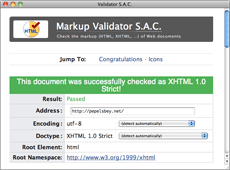

Зачастую HTML-валидатор — это не только способ похвастаться аккуратным кодом, поставив зелёную галочку на сайт, но ещё и полезный инструмент для непосредственной разработки. Контроль аккуратности кода, отсутствия каких-то опечаток или неуместных вещей стоит производить как можно чаще.

Validator S.A.C.

Потенциально, код можно периодически скармливать той самой последней инстанции на W3C, но это не слишком удобно для локальных файлов или полевых условий. Альтернативным решением можно назвать использование плагинов для браузеров: [HTML Validator](http://users.skynet.be/mgueury/mozilla/) для Firefox и [Safari Tidy](http://zappatic.net/safaritidy/) для Safari, оба они основаны на движке [HTML Tidy](http://tidy.sourceforge.net/) и, к слову сказать, невероятно криво сделаны. Но W3C HTML Validator и Tidy — это два разных проекта, хоть и преследующие схожие цели. Не берусь судить об их различиях, но факт остаётся фактом.

Есть и другая возможность проверять свой код локально: [W3C HTML Validator](http://validator.w3.org/source/) не только распространяется в виде открытого исходного кода, но также доступен в виде готовых пакетов для \*nix-платформ и, в частности, отдельного приложения для Mac OS X — [Validator S.A.C.](http://habilis.net/validator-sac/)

Это приложение устанавливается простым перетаскиванием в папку «Программы», имеет знакомый интерфейс и позволяет проверять как локальные, так и удалённые страницы и получать результаты идентичные онлайн-валидатору.
