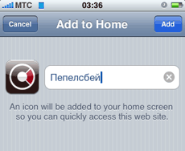
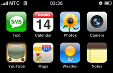

Помните, как в своё время люди радовались фавиконкам? Сайты с ними очень хотелось добавить на панель закладок, чтобы, не глядя на ярлык, с разбегу кликать на запомнившийся значок.

Потом истерия немного утихла: веб-мастера более-менее научились работать с иконками; доля IE6, изредка понимающего их по чистой случайности, начала падать; Яндекс решил показывать их в поисковой выдаче — и эта приятная мелочь стала признаком аккуратности и хорошего тона.

Добавление в закладки

Сегодня, благодаря Apple, значки возвращаются в новом виде: слегка потолстев до размеров 57×57 пикселов, только на платформе iPhone и iPod Touch — но они снова с нами. С выходом в январе прошивки 1.1.3 на указанной платформе, пользователи получили возможность создавать закладки для страниц прямо на панели программ. По умолчанию, этот значок (webclip) показывает уменьшенное изображение той части страницы, на которую вы добавляете закладку. Но для того, чтобы значок выглядел так, как нужно вам, достаточно указать путь к иконке в специальном элементе `<link>`:

    <head>
        <link rel="apple-touch-icon" href="favicon.png">
    </head>

Для большей преемственности, я решил называть их так же, как когда-то иконки для добавления в избранное: `favicon.png`

Панель программ

Формально, иконка должна иметь размеры 57×57 пикселов — такой же, как и все значки приложений. Но на практике, после автоматической пост-обработки (наложения закруглений и блика), лучше выглядят иконки, уменьшенные средствами самого устройства. Удачными исходными размерами [предложено считать](http://playgroundblues.com/posts/2008/jan/15/iphone-bookmark-iconage/) 158×158 пикселов, однако, иконка с сайта Apple имеет размеры 129×129 пикселов. Но всё-таки вписать симметричный лого в чётное количество пикселов проще, как на старой доброй фавиконке. Помимо этого, имеет место эффект сползания центра иконки вниз, так что лучше предварительно сдвинуть лого на 3-5 пикселов выше оптического центра. Примеры исходных иконок: [Пепелсбей.net](/static/i/favicon.png), [Веб-стандарты](https://web-standards.ru/apple-touch-icon.png), [Apple](http://www.apple.com/apple-touch-icon.png).

В результате всех манипуляций, иконка подгружается прямо в момент добавления закладки и аккуратно помещается на панели программ.
