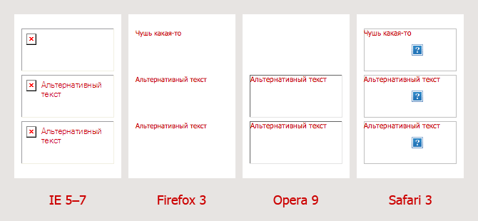

Создавая доступные сайты, без сомнения, стоит обращать внимание и на то, как они выглядят при отключённой графике. Существует ряд традиционных рекомендаций, которые помогут вам в такой ситуации:

- Не забывайте добавлять фоновый цвет при указании фонового изображения, когда цвет фона страницы совпадает или не слишком контрастирует с цветом текста.
- Постарайтесь обрисовать основные блоки, очертания которых формируются с помощью картинок, при помощи цвета фона или рамок. Чтобы каркас вашего сайта прорисовывался и без графики. Как пример такой практики — задание слабо контрастного цвета фона элементов `` для иллюстраций в тексте для того, чтобы избежать дырок в тексте — конечно при условии, что картинкам заданы размеры.
- Не ленитесь указывать альтернативный текст для изображений и не забывайте, что этот текст можно оформлять, применяя стили шрифта к элементу ``.

В принципе, можно продолжать и дальше, но я не об этом. Обратите внимание на последнюю рекомендацию — о ней помнит большинство верстальщиков, иначе можно получить линейкой по рукам от валидатора. Однако мало кто вспоминает про такой слегка сомнительный, но пока вполне легальный элемент, как `<input type="image">`

И чёрт с ней, с иллюстрацией — не увидят, да может и к лучшему. А вот невозможность отправить форму при отсутствующей или неявно присутствующей кнопке — это уже дело посерьёзнее. И что будем делать? Понятное дело — прописывать текст действия, написанный или подразумеваемый на картинке. Но как? К примеру, встретил я на днях такое:

    <input type="image" src="send.gif" value="Отправить">

Судя по всему, это сработано по аналогии с `<input type="submit">`, где задание атрибута `value="Отправить"` задаёт текст действия на кнопке. И ведь работает, правда, местами… Однако, как нам известно, элемент `<input type="image">` имеет красноречивый атрибут `alt` (наряду с типично картиночными `align, usemap, ismap`), предназначенный как раз для задания альтернативного текста.

Учитывая то, что валидатор не имеет ничего против атрибутов `value` и `alt` для `<input type="image">` в XHTML 1.0 Strict документе, то давайте проверим на практике — кто же из них круче. Предложим такой код следующему зверинцу: IE 5–7, Firefox 3, Opera 9, Safari 3…

    <input type="image" src="send.gif" alt="Альтернативный текст">
    <input type="image" src="send.gif" value="Чушь какая-то">
    <input type="image" src="send.gif" value="Чушь какая-то" alt="Альтернативный текст">

…и получаем:

Альтернативный текст: alt vs. value

Выходит, что `value` хоть и срабатывает в Firefox и Safari как альтернативный текст, но всё же напрочь перебивается значением `alt`, которое стабильно отображается во всех протестированных браузерах.

Вывод очевиден — помимо правильности использования атрибута `alt` по прямому назначению, это ещё и самый стабильный способ задания альтернативного текста для элемента `<input type="image">`.
