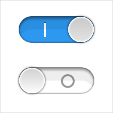
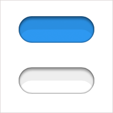
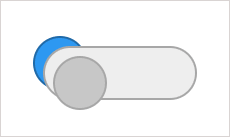
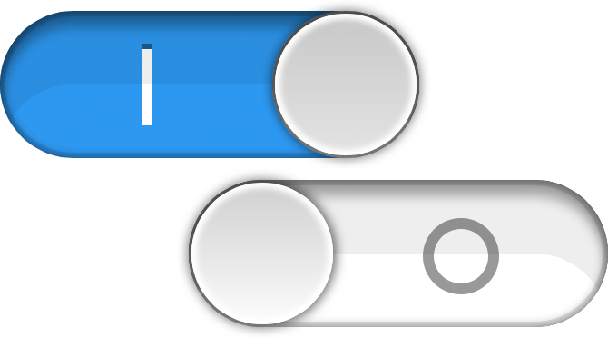

Большой молодец [Рома Комаров](http://kizu.ru) прочитал на [Web Standards Days в Москве](http://webstandardsdays.ru/2011/12/13/) доклад-размышление «[Бесчеловечные эксперименты над CSS](https://vimeo.com/34190518)», суть которого я вам пересказывать не буду — лучше посмотрите сами. В частности, Рома призывал, при виде новой сногсшибательной CSS-демки, не смотреть в код, пытаясь понять как она сделана, а пытаться реализовать её самому. «Отличная идея!» — подумал я тогда. И вот сегодня утром, глядя на «[Переключатель в стиле iOS на CSS](http://www.aether.ru/blog/2012/08/19/iswitch)» Александра Шабуневича, не удержался, чтобы не сделать свой вариант и рассказать вам подробно о том, как это работает.

Хочу предупредить заранее, что я не большой любитель демок, в которых всего 20 000 элементов `<b>` и 3 000 строк грязного CSS создают что-нибудь невероятно красивое и столь же бесполезное. Я конечно уже был замечен за «[Чаем со спецэффектами](/blog/special-effects-tea/)», но ту демку хотя бы можно было разобрать на полезные каждый день части. С этим переключателем получилось ещё лучше. Поехали!

## HTML-скелет

Результат по ссылке.

Прежде чем рваться в бой, вкладывая `
` в `
` и оборачивая это в ещё один `
`, давайте подумаем, на что больше всего похож этот переключатель. Если посмотреть на него внимательно, то видно, что у него всего два положения. И пусть вас не смущает внешний вид этого переключателя, это просто **Выкл.** и **Вкл.**, а сам он уместно смотрелся бы в составе какой-нибудь формы. Александр, [в своей демке](http://beholder.bitbucket.org/iswitch/), решил, что это скорее две радиокнопки `<input type="radio">` с двумя отдельными лейблами и одинаковым атрибутом `name`, значит при включении одной, тут же выключается вторая. Что ж, может быть. Но мне показалось, что это скорее чекбокс, у которого тоже может быть два состояния.

    

        <input type="checkbox" id="switch" class="switch-check">
        <label for="switch" class="switch-label">Опция</label>
    

Раздадим всем элементам классы в пространстве имён родителя: `switch`, `switch-check` и `switch-label` и не забудем связать лейбл и чекбокс с помощью атрибутов `id` и `for`.

## Делаем красиво

Пока наш переключатель выглядит просто и удобно: [plain.html](demo/plain.html). И вроде бы: чекбокс и лейбл — жми и поехали, хватит время терять. Но мы здесь делаем _красиво_, поэтому нам сначала нужно спрятать всё, что _некрасиво_. Вместо того, чтобы шаманить с нестандартным свойством `appearance`, мы просто спрячем чекбокс с помощью `opacity: 0` (чтобы на него всё ещё можно было перейти табом — `visibility: hidden` это отключает) и уберём текст лейбла с помощью `text-indent`, само тело лейбла нам ещё пригодится.

    .switch-check {
        position: absolute;
        opacity: 0;
    }

    .switch-label {
        text-indent: -9999px;
    }

Теперь пришло время рисовать форму с помощью CSS. Если хорошо знать все возможности CSS3, то почти любую картинку можно мысленно разложить на рамки, тени, фоновые картинки, скругления и прочие доступные изобразительные средства. Примерно так же, как мы в своё время умели разбивать любой макет на столбцы и строки будущей таблицы. Но не будем о тёмном прошлом.

Белая и синяя формы переключателя.

Если не заниматься попиксельной имитацией того, что нарисовали дизайнеры Apple для iOS, то кнопка легко разбивается на CSS-примитивы. Если заниматься, то вы просто потратите на день или два больше. Я осознанно отбросил некоторые несущественные или слишком сложные для реализации мелочи, чтобы не усыплять вас их описанием.

Сначала давайте нарисуем форму, которая является основой синей и белой части нашего переключателя. Видно, что отличаются они только фоновым цветом. Задаём скругление в половину высоты с помощью `border-radius`, базовый синий или белый цвет, а всю остальную красоту рисуем последовательно с помощью четырёх внутренних теней, в порядке следования в блоке `box-shadow`:

1. Первая двухпиксельная тень без размытия: третий параметр равен нулю и четвёртый только добавляет смещения чёрной тени с прозрачностью 10%;
2. Вторая простая четырёхпиксельная тень, дающая основное углубление на половину чёрным;
3. Третья четырёхписельная тень нависающая сверху на 5 пикселей на треть чёрным;
4. Четвёртая тень без размытия, со смещением сверху на половину высоты переключателя всего на 7 сотых чёрного поверх основного фона.

Пример:

    .switch {
        width: 154px;
        height: 54px;
        border-radius: 27px;
        background: #369aee;
        box-shadow:
            0 0 0 2px rgba(0, 0, 0, 0.1) inset,
            0 0 4px rgba(0, 0, 0, 0.5) inset,
            0 5px 4px 1px rgba(0, 0, 0, 0.3) inset,
            0 27px 0 rgba(0, 0, 0, 0.07) inset;
    }

Размеры 154×54 пикселей я взял прямо из iOS — именно такие размеры имеет переключатель в версии для ретины. В итоге получается уже что-то похожее на правду: [shape.html](demo/shape.html).

## Придумываем слайдер

Сейчас нам нужно решить, как именно будет ездить наш слайдер. В оригинальном переключателе iOS к круглой ручке переключателя как будто прикреплены два блока: синий слева и белый справа. Передвижение слайдера как будто уводит каждый из них за пределы отверстия, которым является переключатель.

К сожалению, из-за особенностей работы `overflow: hidden` и `border-radius`, у нас не получится кроссбраузерно повторить то, что говорит нам понимание происходящего. Браузеры очень по-разному трактуют скрытие за радиусом скругления. Но мы можем сделать так, чтобы это _выглядело_ в точности так, как нам нужно.

Но для этого нам понадобятся два дополнительных элемента. Сам лейбл мы, к сожалению, использовать не сможем — он должен стоять на месте и передавать клики на чекбокс, который и будет контролировать поведение нашего слайдера. Поэтому вложим в слайдер два элемента `switch-slider` с подклассами `-on` и `-off`:

    

        <input type="checkbox" id="switch" class="switch-check">
        <label for="switch" class="switch-label">
            Опция
            
            
        </label>
    

Элемент `-on` будет отвечать за синий блок слева от ручки, а `-off` за белый справа. В синий мы перенесём тот фон, который с самого начала был на самом переключателе. В элемент `-off` мы как раз и впишем нашу ручку с градиентом и парой теней для объёма, поскольку он следует последним и оказывается сверху:

    .switch-slider-off::after {
        position: absolute;
        top: 1px;
        left: 1px;
        width: 52px;
        height: 52px;
        border-radius: 50%;
        background: #e5e5e5;
        background: linear-gradient(#d0d0d0, #fdfdfd);
        box-shadow:
            0 0 2px 2px #fff inset,
            0 0 4px 1px rgba(0, 0, 0, 0.6);
        content: '';
    }

Остаётся только добавить иконки, обозначающие состояния переключателя. Сначала я сверстал их с помощью ещё одних псевдоэлементов, чтобы похвастать потом «Смотрите, только CSS!» Но это снова привело к проблемам со скрытием объектов за `border-radius` и я позволил себе вставить эти картинки графикой. Но графикой не простой, а векторной. В итоге к добавились два файла: [off.svg](demo/images/off.svg) и [on.svg](demo/images/on.svg), которые прекрасно масштабируются и выглядят шикарно на новых дисплеях. При желании, для этих векторых иконок легко делается фолбек в растр, подробнее об этом можно прочитать в начале прошлой заметки «[Непростая простая кнопка](/blog/uneasy-easy-button/)».

Иконка для белого блока указывается фоновой картинкой с отступом слева, а вот иконка для синего блока должна прикрепляться к правому краю (ниже вы поймёте почему), но отступать от него на фиксированное количество пикселов. Поэтому мы задаём смещение фона для синей иконки `100% 12px` и добавляем нужный отступ прямо в SVG-файле, меняя его ширину. Не очень изящно, зато вполне кроссбраузерно.

## Анимация слайдера

Схематичная анимация слайдера. Осторожно, не залипните.

Теперь у нас готовы все элементы и пора бы уже сделать так, чтобы переключатель заработал. Работать он будет с помощью псевдокласса `:checked`, который будет срабатывать при включённом чекбоксе и передавать это состояние с помощью сестринского селектора `E + E` и дальше прямо к слайдерам.

Посмотрите внимательно на анимацию: в состоянии по умолчанию, синий блок слева от ручки будет той же ширины, что и ручка, а белый закрывать всё это. Но как только переключатель будет активирован, всё должно будет поменяться в точности наоборот: синий растянется на всю ширину, а белый спрячется за ручкой. Такая сложность нужна для того, чтобы создать иллюзию уезжающих иконок. Так и сделаем:

    .switch-check:checked + .switch-label .switch-slider-on {
        width: 154px;
    }

    .switch-check:checked + .switch-label .switch-slider-off {
        width: 54px;
    }

А чтобы изменение ширины слайдеров не происходило одним прыжком, опишем плавный переход от одной ширины к другой с помощью `transition` и не забудем, что у активной ручки слайдера фон и градиент немного темнее, и что по слайдеру можно не просто кликнуть, но ещё и выделить его табом и нажать пробел для переключения:

    .switch-slider {
        transition: width 0.2s linear;
    }

    .switch-label:active .switch-slider-off::after,
    .switch-check:focus + .switch-label .switch-slider-off::after {
        background: #d5d5d5;
        background: linear-gradient(#c8c8c8, #e4e4e4);
    }

Ура, переключатель заработал! Смотрите сами: [check.html](demo/check.html). И вроде бы всё, но зуд всё не унимался и я сделал ещё одну версию с помощью двух радиокнопок и двух лейблов, что в итоге несколько усложнило код, ведь пришлось на ходу менять `z-index` лейблов в каждом из состояний: [radio.html](demo/radio.html). Правда, это делает слайдер недоступным для фокусировки табом, ведь радиокнопки две, а он один.

А теперь давайте посмотрим на то, ради чего была вся эта возня с CSS и SVG вместо того, чтобы сделать всё двумя-тремя обычными картинками. Зайдём в браузер и сильно увеличим наш переключатель:

Переключатель, сильно увеличенный средствами браузера. Красиво, да?

И вот теперь точно всё. Можно было бы конечно вытащить текст лейбла влево в виде подписи, добить совместимость с IE7 и может быть поработать над универсальным способом менять размер переключателя. Но я оставлю эти эксперименты вам, моим внимательным и пытливым читателям.
