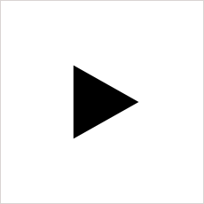
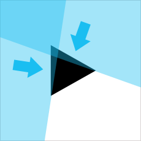
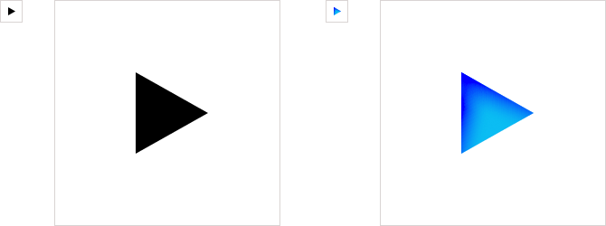

Надеюсь, ни для кого уже не секрет, что оформительскую графику на сайтах давно пора переводить в формат SVG с растровым фолбеком (при необходимости). Кто понял это раньше, чем экраны с ретиной, готовые поспорить по качеству картинки с полиграфией, появились на 4-м айфоне, новом айпаде, а теперь и [на новом макбуке](http://www.apple.com/macbook-pro/features/) — тот большой молодец. Но если кто-то до сих пор не в курсе, у меня специально для вас есть комикс [SVG vs PNG](http://svgvspng.com/#ru).

В отличие от сложных методов, вроде `-webkit-image-set`, для которых нужно указывать несколько источников картинки в зависимости от разрешения, в случае с SVG нужна всего одна векторная картинка для всех случаев:

    E {
        background: url(image.png) no-repeat;
        background: rgba(0, 0, 0, 0) url(image.svg) no-repeat;
    }

Удивлены, зачем перед второй декларацией стоит прозрачный чёрный цвет? Браузеры, которые не понимают SVG и о которых пока приходится заботиться, в нашем случае это всеми любимые IE6, IE7 и IE8, помимо прочего, не поддерживают цветовую модель `rgba(…)` в CSS, поэтому декларация для них окажется невалидной и будет отброшена. К сожалению, это не сработает в Firefox 3.6 и в старых браузерах на движке Webkit, которые стоят на системах вроде Android 2.2 (как на моём HTC Desire), поэтому для них будет уместнее использовать определение поддержики SVG с помощью [Modernizr](http://modernizr.com). Тогда вам придётся написать что-то вроде:

    E {
        background: url(image.png) no-repeat;
    }

    .inlinesvg E {
        background: url(image.svg) no-repeat;
    }

Поскольку в Firefox 3.6 есть базовая поддержка SVG (через элемент `<object>`), но нет поддержки SVG в для фоновых изображений в CSS, то определять поддержку нужно будет не через класс `.svg`, а через `.inlinesvg`, который [появился в Firefox 4.0](https://developer.mozilla.org/en/Firefox_4_for_developers) вместе с поддержкой векторных фоновых картинок.

Дальше мы просто экспортируем SVG-картинку из любимого векторного редактора, чистим от мусора, расставляем недостающие параметры, вставляем в CSS фоном. Но дьявол, как известно, в мелочах, и даже простую кнопку с векторной иконкой можно сделать пятью разными способами. Поэтому давайте пройдём шаг за шагом процесс создания кнопки, решая разные проблемы, возникающие по дороге, и даже просто выдумывая себе новые.

Если вы не слишком хорошо знакомы с SVG, то прежде чем читать дальше, вы можете отвлечься на мой доклад «[Веб в кривых. Второе рождение SVG](/blog/web-in-curves/)» или хотя бы пролистать [презентацию к нему](/pres/web-in-curves/) и посмотреть примеры.

## Самая простая кнопка

Простая кнопка, увеличенная примерно в 10 раз для наглядности

Давайте начнём с самой простой кнопки «Play», которая согласно первоначальной дизайнерской идее представляет собой чёрный треугольник, который должен быть вписан в белый квадрат размером 25×25 пикселей. Любители CSS-графики тут же попытаются сделать её с помощью лошадиных размеров рамок, диагонали которых нормально сглаживаются только при углах, кратных 45°, а мы с вами пока продолжим.

Начинать всегда стоит с HTML, и мы возьмём для нашей кнопки элемент «кнопка», что может быть логичнее! Предусмотрим сразу абстрактную кнопку `.button` и её подвид `.play`.

    <button class="button play">Play</button>

И добавим простой CSS:

    .button {
        display: inline-block;
        padding: 0;
        width: 25px;
        height: 25px;
        border: none;
        background: #000 no-repeat;
        text-indent: -9999px;
    }

    .button.play {
        background-image: url(images/play-button.png);
        background-image: rgba(0, 0, 0, 0) url(images/play-button.svg);
    }

Если мы собираемся делать векторную графику, понятно, что без векторых исходников нам не обойтись. Первым делом хочется поступить с этим треугольником так же, как мы раньше поступали с растровой графикой: просто сохранить его как SVG и поставить фоном. Но в нашем случае фигура настолько простая, что вместо экспорта её будет проще написать руками. Заодно мы сможем понять, как работает SVG, и нам не придётся чистить экспорт от мусора. Возьмём шаблон минимального SVG-файла и вставим в него элемент `<polygon>` с тремя точками, соответствующими вершинам нашего треугольника. Координаты точек в Illustrator можно подсмотреть, наведя курсор на каждую из них. Пары координат через запятую разделяются пробелами: `x1,y1 x2,y2`.

    <svg xmlns="http://www.w3.org/2000/svg" width="8" height="9">
        <polygon fill="#000" points="0,0 8,4.5 0,9"/>
    </svg>

Если мы зададим размеры SVG-элементу с помощью атрибутов `width` и `height`, иконка будет вести себя как растровая и всегда будет указанных размеров, куда бы мы её не вставили. Это вполне нормально и выполняет нашу задачу по отрисовке чёткой графики для дисплеев с высоким разрешением. Но указание явных размеров лишает нас одного из преимуществ формата — возможности подстаиваться под размеры объекта, фоном к которому он указан.

Поэтому давайте вместо размеров укажем нашей иконке атрибут `viewBox` (именно с прописной «B», иначе не сработает) со значением `0 0 8 9`, где 8 и 9 — это ширина и высота нашей иконки в пикселях. Подробнее про **viewBox** и другие его параметры [читайте в спецификации SVG](http://www.w3.org/TR/SVG/coords.html#ViewBoxAttribute).

    <svg xmlns="http://www.w3.org/2000/svg" viewBox="0 0 8 9">
        <polygon fill="#000" points="0,0 8,4.5 0,9"/>
    </svg>

А теперь откройте по очереди два файла [play-fixed.svg](images/play-fixed.svg) и [play-viewbox.svg](images/play-viewbox.svg) в новых вкладках и сравните результат. При указанных размерах SVG сохраняет их, а с указанным `viewBox` пытается вписаться в размеры окна или элемента, сохраняя пропорции. Поэтому если мы захотим сделать ещё одну кнопку не 25×25, а 100×100 пикселей, то нам не придётся создавать новую иконку для неё.

Но в нашем случае нужно не просто вписать треугольник во все 25×25 пикселей кнопки, а сохранить пропорции отступов и расположения треугольника. Поэтому давайте сделаем нашу картинку сразу нужных размеров и спозиционируем иконку ровно так, как на макете с дополнительным смещением для координат. В итоге получится файл [play-button.svg](images/play-button.svg).

    <svg xmlns="http://www.w3.org/2000/svg" viewBox="0 0 25 25">
        <polygon fill="#000" points="9,8 17,12.5 9,17"/>
    </svg>

Но это слишком просто. Сделаем что-нибудь поинтереснее.

## Кнопка без тени — деньги на ветер

Непростая кнопка с синей заливкой и внутренней тенью

И тут к нам забегает дизайнер чёрного треугольника (и большой поклонник Малевича, по-видимому) и говорит, что совсем забыл про активное состояние кнопки. Во время воспроизведения она должна гореть голубым цветом и выглядеть вдавленной. Поменять цвет заливки нашей картинки теперь просто как никогда, ведь мы сами писали этот треугольник и знаем, как там всё устроено. А вот внутреннюю тень дизайнер нарисовал с помощью одного из сотни спецэффектов в Photoshop или Illustrator. И мы могли бы скомбинировать десяток SVG-фильтров и попытаться сделать настоящую тень, но это становится слишком сложной задачей, и с кроссбраузерностью у фильтров не всегда хорошо.

Градиенты для имитации внутренней тени

Поэтому мы попробуем имитировать эту тень с помощью двух градиентов. Один мы пустим по верхней грани нашего треугольника, другой по левой, немного повернём каждый из них и добьёмся размытием нужного эффекта. Для того чтобы градиенты правильно наложились в одну тень поверх фонового цвета, они должны начинаться в 100% прозрачности и выходить в нулевую. Градиенты в SVG появились намного раньше, чем в CSS, и имеют свой особенный синтаксис, немного отличающийся от того, к чему мы привыкли.

Сам градиент, как и другая метаинформация, задаётся в специальной секции `<defs>` и описывается элементом `<linearGradient>`, который можно повернуть с помощью атрибута `gradientTransform`. Каждый цвет, его смещение и прозрачность описываются во вложенном элементе `<stop>`.

    <linearGradient x1="0" y1="0" x2="0" y2="100%" id="shadow-left"
            gradientTransform="rotate(-75 0.5,0.5)">
        <stop stop-color="#0020FF" offset="0"/>
        <stop stop-color="#1ABEF1" stop-opacity="0" offset="40%"/>
    </linearGradient>

Мы с вами оказались чертовски предусмотрительны и задали каждому из двух градиентов ID `shadow-left` и `shadow-top`, и теперь сможем вызвать их с помощью атрибута `fill="url(#shadow-left)"` и значением ID в качестве параметра. Но для того, чтобы этот трюк сработал, нам нужно будет добавить к корневому элементу `<svg>` ещё один атрибут `xmlns:xlink`, описывающий пространство имён **xlink**.

Мне так и не удалось применить несколько градиентов к одному элементу одновременно с заливкой, и, кажется, это просто невозможно. Поэтому придётся продублировать наш треугольник трижды: сначала со сплошной заливкой, потом с левым и с верхим градиентом. Те элементы, что пойдут последними, окажутся выше, как и в HTML.

    <svg xmlns="http://www.w3.org/2000/svg"
         xmlns:xlink="http://www.w3.org/1999/xlink"
         viewBox="0 0 25 25">
        <defs>
            <!-- Описание градиентов -->
        </defs>
        <polygon points="9,8 17,12.5 9,17" fill="#1ABEF1"/>
        <polygon points="9,8 17,12.5 9,17" fill="url(#shadow-left)"/>
        <polygon points="9,8 17,12.5 9,17" fill="url(#shadow-top)"/>
    </svg>

Можно было бы конечно создать символ треугольника, а потом применить его снова с помощью элемента `<use>`, но у этого способа плохо с кроссбраузерностью в Webkit. Итак, наш супер-треугольник с градиентами, складывающимися в тень: [play-active.svg](images/play-active.svg).

Если совместить получившуюся картинку с нашей кнопкой и добавить активное состояние с помощью класса `.active`, то получится вот такая красота: [play-plain.html](demo/play-plain.html). В этом примере, в силу очевидности, специально нет растрового фолбека, а кнопки специально увеличены в 10 раз, чтобы можно было рассмотреть, насколько прекрасна векторная графика.

Обычная и активная кнопки и их увеличенные варианты

## Маски-шоу

Наша красивая кнопка готова, но не знаю, как вам, а мне всё мало и хочется больше чудес. Было бы хорошо не бегать в SVG, настраивая все параметры кнопки, а делать всё прямо в CSS. И даже больше — хочется иметь одну форму треугольника в SVG, а все его подробности рисовать в CSS, включая состояния по наведению и даже плавные переходы. Очень напоминает маску, не так ли?

Принцип псевдомаски

Как вы помните, полноценных кроссбраузерных масок в CSS нет. К сожалению, пока нет даже спецификации, в которой они были бы описаны. Маски уже давно есть в SVG, но в нашем случае это не поможет.

Поможет нам старый добрый трюк, допустимый только для однородного и постоянного фона под объектом. Допустим, что наша кнопка всегда будет на белом фоне или нам не лень нарисовать маски для нескольких других фонов. Мы нарисуем SVG-картинку, залитую сплошным цветом и сделаем в ней дырку как раз той формы, что и наш треугольник. А всё остальное оформление будем рисовать в CSS.

И если наш простой треугольник состоял из трёх точек, то маску с двумя контурами нужно будет рисовать уже с помощью кривых Безье, прямо в редакторе. На самом деле, всё просто. Мы берём квадрат 25×25, кладём на него треугольник и вычитаем формы, пробивая в прямоугольнике дырку нужного вида, любой векторный редактор это умеет.

Но в использовании таких масок есть небольшой нюанс. К сожалению, браузеры до сих пор не слишком точно рассчитывают размеры и расположение фона при масштабировании объектов, особенно это заметно на мобильных устройствах, как с растровой, так и с векторной графикой. Решить эту проблему можно, добавив дополнительно один или несколько пикселей фоновой заливки с каждой из сторон. В случае с SVG эти дополнительные пиксели могут лежать за пределами видимой области и всё равно будут нам помогать.

Поэтому размеры нашей маски будут на 3 пикселя больше с каждой стороны, при том же **viewBox** 25×25 пикселей. Почитать, как формируется кривая Безье в атрибуте `d` для элемента `<path>`, можно [у Ярослава Карандашева](http://y3x.ru/2011/07/svg-path2/). А мы просто экспортировали её из векторного редактора.

    <svg xmlns="http://www.w3.org/2000/svg" viewBox="0 0 25 25">
        <path fill="#FFF" d="m-3-3v31h31v-31h-31zm12 20v-9l8 4.5-8 4.5z"/>
    </svg>

После того, как маска создана, нам нужно перенести градиент в CSS. К сожалению, сделать это даже простым копированием значений не получится. Ведь в CSS пока другая система поворота градиентов и у нас несколько другая ситуация. Если для треугольника мы рисовали градиент прямо в пределах его контура, то маска будет скрывать градиент, нарисованный в пределах всей кнопки. Поэтому градиент мы пишем заново.

Основной цвет активной кнопки мы укажем в `background-color`, а в `background-image` перечислим через запятую маску и два градиента. Здесь всё наоборот — кто первый, тот и выше.

    .button.play.active {
        background-color: #1ABEF1;
        background-image:
            url(images/play-mask.svg),
            linear-gradient(105deg, #0020FF 38%, rgba(26, 190, 241, 0) 49%),
            linear-gradient(200deg, #0020FF 41%, rgba(26, 190, 241, 0) 52%);
    }

Все необходимые префиксы для работы градиентов (`-webkit`, `-moz` и `-o`) перечислены в итоговом файле. Но это не единственная разница: градиенты с префиксами должны получить ещё и другие значения градусов. Дело в том, что с момента внедрения градиентов в браузерах, спецификация изменилась и если раньше значения отсчитывались от трёх часов (представьте циферблат часов) и против часовой стрелки, как на уроках геометрии, то сейчас отсчёт идёт от полудня и по часовой стрелке, что естественнее для CSS в целом. Значит по старому синтаксису повороты будут `-15deg` и `-110deg`, а по новому, без префикса, `105deg` и `200deg`, соответственно.

В итоге мы получим ту же самую роскошную кнопку, но всего с одним SVG-файлом для маски и с оформлением прямо в CSS: [play-mask.html](demo/play-mask.html). Вы можете попробовать модифицировать этот пример и убедиться, насколько удобно работать с иконкой прямо в CSS. Все примеры, использованные в этой заметке, можно загрузить одним архивом: [play.zip](play.zip) (17 КБ)

Понравилась кнопка? Можно сделать лучше? Не стесняйтесь, расскажите в комментариях.
